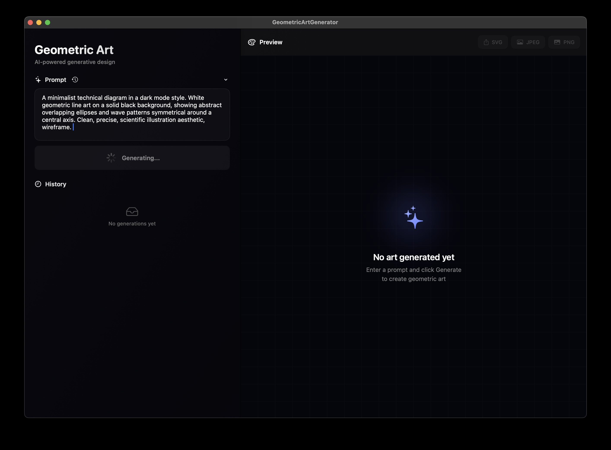
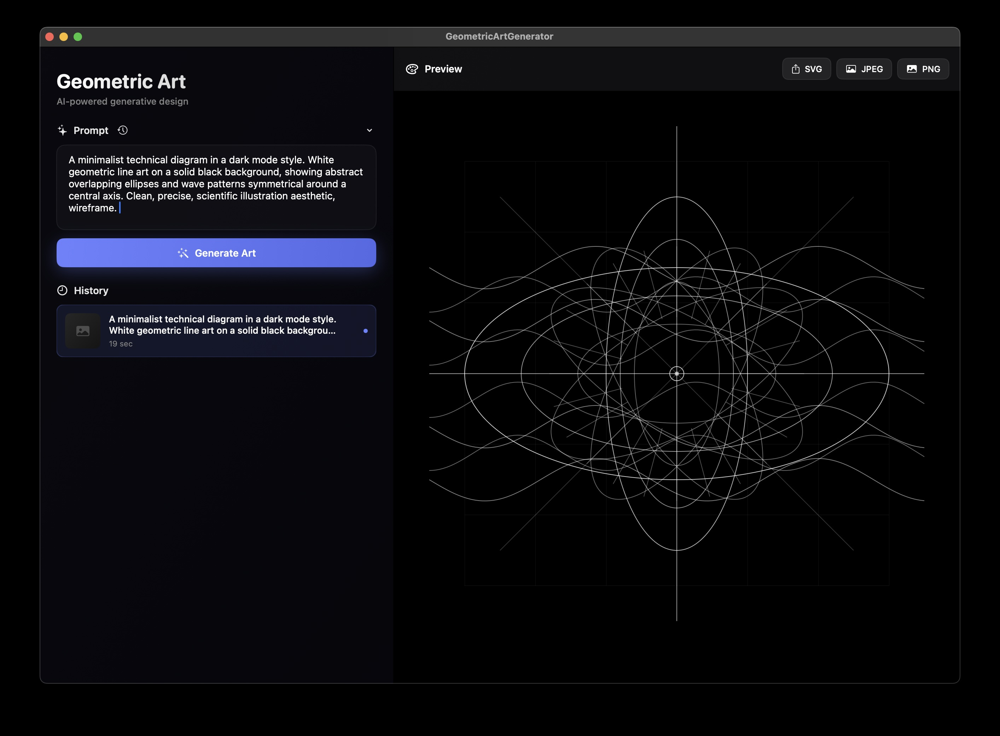
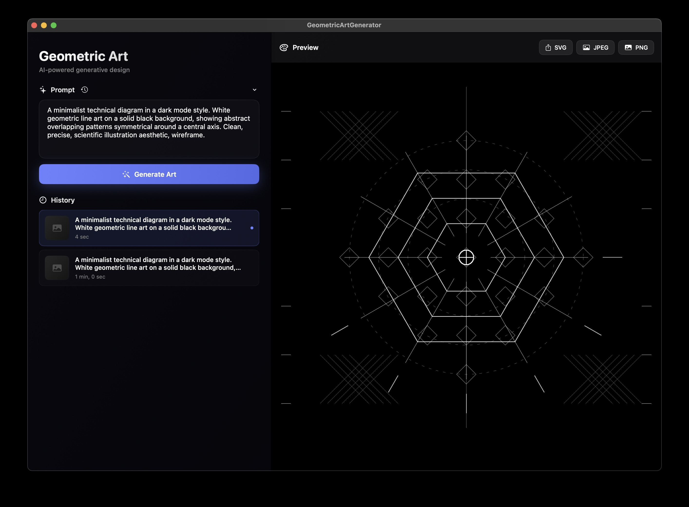

<h1 align="center">
</img>
<p>Geometric Art Generator</p>
</h1>

A macOS app that uses AI to generate stunning geometric art from simple text descriptions.

## Screenshots




## 🚀 Getting Started

### Prerequisites

- macOS 13.0 or later
- Xcode 14.0 or later
- Python 3.x installed on your system
- Anthropic API key (get one from [console.anthropic.com](https://console.anthropic.com))

### Installation

1. **Clone the repository**
   ```bash
   git clone https://github.com/yourusername/GeometricArtGenerator.git
   cd GeometricArtGenerator
   ```

2. **Open in Xcode**
   ```bash
   open GeometricArtGenerator.xcodeproj
   ```

3. **Build and Run**
   - Press `Cmd+R` in Xcode
   - Or: Product → Run

4. **Add Your API Key**
   - Press `Cmd+,` to open Settings
   - Paste your Anthropic API key
   - Click "Save Settings"

5. **Generate Your First Art**
   - Click any example prompt (like "circles")
   - Click "Generate Art"
   - Watch as AI creates your geometric masterpiece!
